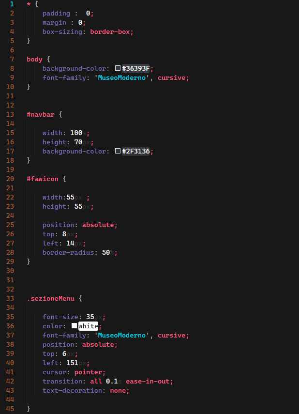

# rikvik2006 red theme
## This is the README for your extension "rikvik2006-redtheme"

Hi, I'm rikvik2006, a guy with a passion to become a full-stack web developer.
I created this theme since I spend countless hours on Visual Studio Code, and so I decided to create a theme with the colors I liked the most.
If you share this opinion with me then what is up to installing the theme.

## Screenshots

HTML

CSS

### For more information
* [Visual Studio Code's Markdown Support](http://code.visualstudio.com/docs/languages/markdown)
* [Markdown Syntax Reference](https://help.github.com/articles/markdown-basics/)

**Enjoy!**
